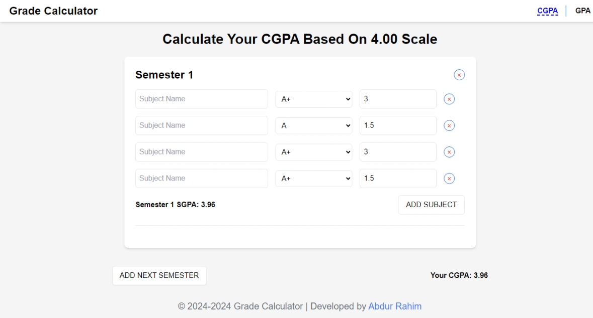
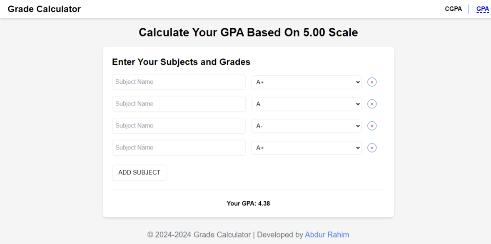

# Grade Calculator using Reactjs
This is a simple grade calculator that calculates the final grade of a student based on the marks obtained in the exams. This project is built using Reactjs.  

## Features
- Add a new subject
- Delete a subject
- Update marks of a subject
- Calculate the GPA based on the marks obtained
- Calculate semester wise SGPA and CGPA 

## Installation

1. Clone the repository
```bash
git clone https://github.com/AbdurRaahimm/Grade-Calculator.git
```
2. Change the directory
```bash
cd Grade-Calculator
```
3. Install the dependencies
```bash
npm install
```
4. Run the application
```bash
npm run dev
```
5. Open the browser and go to http://localhost:5173/

## Live Demo
[Live Demo](https://grade-calculator-4g.netlify.app/)


## Built With
- [Reactjs](https://reactjs.org/) - A JavaScript library for building user interfaces
- [Vite](https://vitejs.dev/) - A build tool that aims to provide a faster and leaner development experience for modern web projects
- [Tailwind CSS](https://tailwindcss.com/) - A utility-first CSS framework for rapidly building custom designs
- [React Router](https://reactrouter.com/) - Declarative routing for React.js


## Screenshots




## License
This project is licensed under the MIT License - see the [LICENSE](LICENSE) file for details

## Contributing
Pull requests are welcome. For major changes, please open an issue first to discuss what you would like to change.


## Connect on Social Media
- [Twitter](https://twitter.com/AbdurRahim4G)
- [Instagram](https://www.instagram.com/abdurrahim4g/)
- [Facebook](https://www.facebook.com/Rahim72446)
- [LinkedIn](https://www.linkedin.com/in/abdur-rahim4g/)
- [YouTube](https://youtube.com/@AbdurRahimm)


